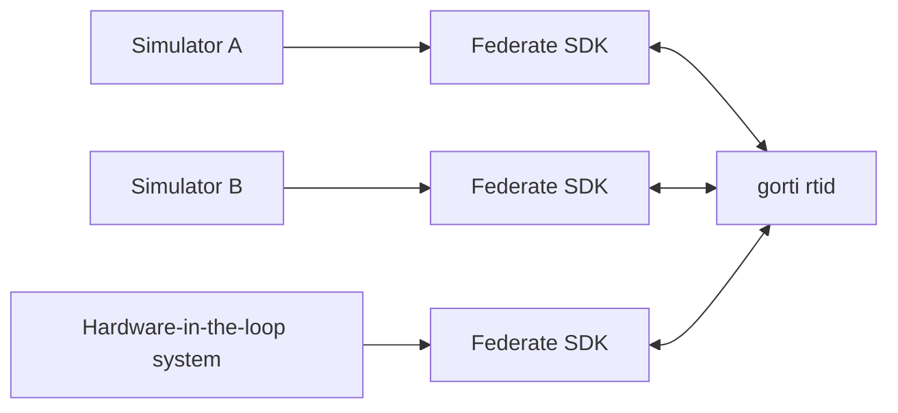

# gorti

[](https://github.com/cbchoi/gorti/actions/workflows/ci.yml)
[](https://github.com/cbchoi/gorti/actions/workflows/docs.yml)
[](https://github.com/cbchoi/gorti/releases)
[](LICENSE)
[](https://pkg.go.dev/github.com/cbchoi/gorti)

gorti is an open-source IEEE 1516-2010 (HLA Evolved) Run-Time
Infrastructure written in Go. It includes a standalone RTI server and federate
SDKs for Go, Python, and C++.

## The problem HLA solves

Large simulations are rarely one program. A vehicle model may be written in
C++, an environment model in Python, and a hardware-in-the-loop simulator may
run on another machine. Those programs need a shared model of data, time, and
ownership, not just a network connection.

[High Level Architecture (HLA)](https://standards.ieee.org/ieee/1516/4118/)
is the international standard used to connect these independently developed
simulators. The RTI is the middleware that implements the standard. It manages
federation membership, object state, interactions, logical time, ownership,
and data distribution.

HLA/RTI is used in defense, aerospace, transportation, manufacturing, digital
twins, and training systems. An open implementation matters because its
ordering rules, failure behavior, and performance tradeoffs can be inspected
and reproduced.



## Why another open RTI?

[Portico](https://github.com/openlvc/portico) is active, mature, and supports
several generations of HLA APIs. [OpenHLA](https://sourceforge.net/projects/ohla/)
is another useful open-source implementation, although its public development
has been inactive for years. The ecosystem benefits from independent RTIs with
different implementation languages and architectures: they make
cross-implementation testing possible and give researchers and students more
than one codebase to study.

gorti uses Go for a small deployment footprint, simple cross-platform builds,
and a concurrency model that fits callbacks and ordered event streams. The
choice of Go is not a claim that an RTI will automatically be faster. Protocol
boundaries, acknowledgement policy, queueing, and callback delivery usually
matter more than the implementation language.

| | Portico | gorti |
|---|---|---|
| Implementation | Java core; C++ binding through the Java runtime | Go RTI server |
| Federate APIs | Java and C++; HLA 1.3, IEEE 1516, and IEEE 1516e | Go, Python, and C++; current work targets IEEE 1516-2010 |
| License | CDDL | MIT |
| Project emphasis | Mature deployment and broad legacy API coverage | Inspectable implementation, documented contracts, and reproducible tests |

This is a scope comparison, not a performance ranking. gorti is not presented
as a replacement for every Portico deployment.

## Current scope

The supported deployment is one authoritative `rtid` process with Go, Python,
or C++ federates. The repository covers federation, declaration, object, time,
ownership, data distribution, synchronization, save/restore, and management
object services.

`rtid` runs the HLA core profile by default. Binary audit journaling and
bounded replay are provided by the optional `auditreplay` runtime plugin, so
their encoding and storage work is absent from the normal federation path.
See the [operations guide](docs/operations.md) to enable it.

The v0.9 line is intended for research, teaching, CI, federate development,
and controlled single-node experiments. It does not claim:

- formal IVCT certification;
- production multi-node failover;
- a Java federate SDK;
- HLA 1.3 or IEEE 1516-2000 compatibility; or
- equivalence outside the retained verification scenarios.

See the [verification scope](docs/verification.md) and
[Software Test Description](engineering/specifications/current/STD.md) before
using gorti in a critical federation.

## Try it

You need Go 1.22 or later. Clone the repository and run the in-process
ping-pong check:

```bash
git clone https://github.com/cbchoi/gorti.git
cd gorti
go run ./rti/cmd/rtid -mode=pingpong-demo -pingpong-rounds=100 -log-format=text
```

To see federation-wide time coordination, run the two-federate TAR example.
It starts `rtid`, holds one federate at logical time zero for three seconds,
and checks that the other federate does not receive an early grant.

Linux or macOS:

```bash
bash examples/go-tar-wait/run.sh
```

Windows PowerShell:

```powershell
.\examples\go-tar-wait\run.ps1
```

A passing run includes:

```text
[waiter] TAR(5) requested; grant is now blocked by the peer at time 0
[waiter] GRANT(5) after 3s: PASS - peer TAR released the pending request
go-tar-wait: PASS - the peer delay held and then released TAR(5)
```

The [quickstart](docs/quickstart.md) shows the same run in separate terminals.
All runnable scenarios are listed in the [example catalog](examples/README.md).

## Federate SDKs

| SDK | Use case | Documentation |
|---|---|---|
| Go | Native Go federates and the lowest-overhead gorti client path | [`rti/pkg/federate`](rti/pkg/federate/) |
| Python | Async federates, automation, experiments, and simulator adapters | [`pysdk`](pysdk/) |
| C++ | IEEE 1516.1-2010 DLC-style federates on Linux and macOS | [`cppsdk`](cppsdk/) |

The SDKs use gRPC to communicate with `rtid`. They do not implement another
RTI's private wire protocol. Cross-RTI tests compare behavior visible through
the standard API, not transport compatibility.

## Verification

The repository tests service invariants, FOM handling, encodings, callback
order, timestamp-order delivery, teardown, race behavior, and deterministic
replay. Cross-RTI workloads use the same FOM bytes, seed, process choreography,
callback boundary, logging policy, warmups, measurements, and AB/BA run order.

The retained comparison is intentionally small: two independent federate
processes. FM, DM, and receive-order OM scenarios passed against gorti and the
tested reference implementations. A callback-before-grant difference in one
Portico TM scenario is recorded rather than hidden; TM performance is not
compared when the observable behavior differs.

These tests do not prove wire compatibility, unrestricted scale, formal
certification, or equivalence for every federation. Results and limitations
are in [verification](docs/verification.md), the
[comparison harness](verification/README.md), and the
[TM analysis](verification/TIME_MANAGEMENT_PERFORMANCE.md).

Performance experiments live separately under [`benchmark`](benchmark/).
The publication profile derives a deterministic LI or HI workload from
DEVStone and projects every atomic event-value onto one receive-order object
update and one receive-order interaction. Portico and gorti use the same FOM,
payload seed, two-federate choreography, callback boundary, five warm-up runs,
and 30 measured AB/BA runs per implementation. This is an RTI workload derived
from DEVStone, not a DEVStone simulation-kernel score.

## Connecting an existing simulator

An existing model can remain independent of HLA. A federate adapter maps model
outputs to HLA updates or interactions and delivers RTI callbacks to the
model's input transition.

The [pyjevsim real-model example](examples/pyjevsim-real-model/README.md) runs
two actual `pyjevsim.behavior_model.BehaviorModel` subclasses in separate
federate processes. The runner checks that every pulse sent by the generator is
received once and in order by the sink.

```bash
python -m pip install -e "./pysdk[dev,pyjevsim]"
python -m rti1516e._proto
bash examples/pyjevsim-real-model/run.sh
```

Use `.\examples\pyjevsim-real-model\run.ps1` for the last command on Windows.

## Engineering records

The implementation is maintained alongside four versioned engineering
documents:

| Document | Contents |
|---|---|
| [SRS](engineering/specifications/current/SRS.md) | Requirements, constraints, and non-goals |
| [SDD](engineering/specifications/current/SDD.md) | Architecture, state ownership, ordering, and failure handling |
| [IDD](engineering/specifications/current/IDD.md) | Service and wire interfaces |
| [STD](engineering/specifications/current/STD.md) | Test cases, observable semantics, and acceptance evidence |

Historical baselines are kept under `engineering/specifications/history` so a
requirement can be traced to the release in which it changed. The same material
is used in classroom exercises that turn standalone simulators into federates
and inspect their callback and logical-time behavior.

## Build and test

```bash
go build ./...
go test ./...
make verify
make docs
```

The full local toolchain and C++ prerequisites are documented in
[installation](docs/installation.md). The CI policy and contribution workflow
are in [CONTRIBUTING.md](CONTRIBUTING.md).

## Repository map

| Path | Contents |
|---|---|
| [`rti`](rti/) | Go RTI server, services, FOM support, optional audit/replay plugin, and Go SDK |
| [`pysdk`](pysdk/) | Python SDK and pyjevsim bridge |
| [`cppsdk`](cppsdk/) | C++ DLC-style federate SDK |
| [`examples`](examples/) | Runnable federations and simulator adapters |
| [`verification`](verification/) | Semantic and performance comparison harnesses |
| [`benchmark`](benchmark/) | Reproducible DEVStone-HLA Portico/gorti experiment |
| [`docs`](docs/) | User, operation, verification, and release documentation |
| [`engineering`](engineering/) | Current and historical SRS, SDD, IDD, and STD baselines |

Use [GitHub Issues](https://github.com/cbchoi/gorti/issues) for bugs and design
questions. Citation metadata is available in [`CITATION.cff`](CITATION.cff)
and [`codemeta.json`](codemeta.json). gorti is released under the
[MIT License](LICENSE).
